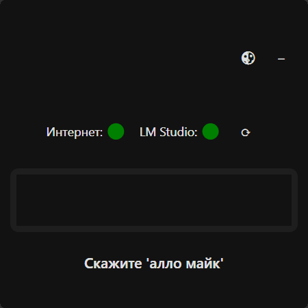
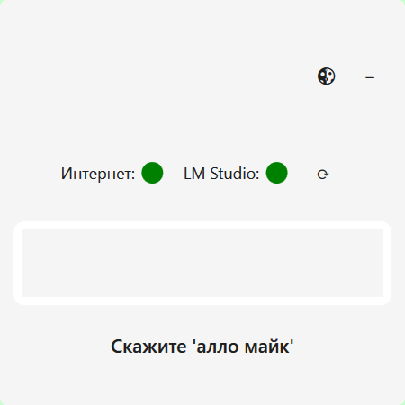
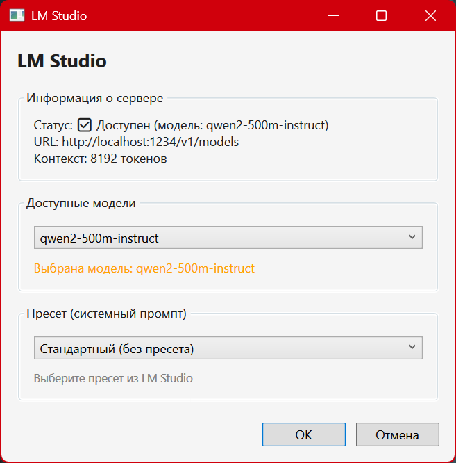

# Mike-Assistant
🎤 Mike Assistant — локальный голосовой ассистент с поддержкой нейросетей

**MikeAssistant** — персональный голосовой помощник для Windows, работающий полностью локально.  
Он умеет распознавать русскую речь, отвечать голосом, выполнять поиск в интернете и общаться с локальной LLM (через LM Studio).  
Проект написан на C# (WPF, .NET Framework 4.8).

 

## ✨ Основные возможности

- 🎙 **Распознавание речи**  
  Использует Microsoft Speech Platform (SAPI) для быстрого распознавания ключевых фраз и [Sherpa-ONNX](https://github.com/k2-fsa/sherpa-onnx) для потокового распознавания произвольной речи.

- 🗣 **Синтез речи**  
  Озвучивание ответов с помощью Sherpa-ONNX TTS (VITS-модель, русский язык).

- 🧠 **Интеграция с LLM (LM Studio)**  
  Возможность отправлять запросы к локальной нейросети (режим «алло квен») и вести диалог с сохранением контекста.

- 🌐 **Поиск в интернете**  
  Открытие браузера с поисковым запросом в Google.

- 📌 **Трей-иконка и управление окном**  
  Работа в фоне, сворачивание в системный трей, индикация активности.

- 🎨 **Тёмная и светлая темы**  
  Переключение на лету.

- ⚙ **Настройки LM Studio**  
  Выбор модели, пресета и просмотр статуса сервера.



## 📦 Требования

- **ОС**: Windows 10/11 (x64)
- **.NET Framework 4.8**
- **LM Studio** (для режима нейросети) – [скачать](https://lmstudio.ai/)
- **Модели Sherpa-ONNX**:
  - STT (распознавание) – модель формата `tone-ctc` (`model.onnx`, `tokens.txt`)
  - TTS (синтез) – VITS-модель (`model.onnx`, `tokens.txt`, папка `data` для espeak-ng)
- **Русский язык распознавания** (устанавливается вместе с Microsoft Speech Platform Runtime 11 и Language Pack)

## 🚀 Установка и запуск

1. **Клонируйте репозиторий**:
   ```bash
   git clone https://github.com/AITISPEC/Mike-Assistant.git
   ```
   
2. **Скопируйте модели Sherpa-ONNX в папку sherpa (на один уровень выше выходной папки сборки)**.
Структура должна выглядеть так:

```text
sherpa/
├── stt/
│   ├── model.onnx
│   └── tokens.txt
└── tts/
    ├── model.onnx
    ├── tokens.txt
    └── data/               (файлы espeak-ng для русского языка)
```
3. **Настройте LM Studio**:
Запустите LM Studio, загрузите любую совместимую модель.
Убедитесь, что сервер запущен на http://localhost:1234 (или измените URL в Config/appsettings.json).

4. **Соберите проект в Visual Studio (режим Debug или Release). Либо скачайте релиз**.
После сборки все зависимости будут автоматически разложены по подпапкам (NAudio, System, Microsoft, Config, Sherpa).

5. **Запустите MikeAssistant.exe**
Приложение свернётся в трей. Скажите «алло майк» для начала диалога.

## 🗂 Структура проекта
MainWindow – главное окно, управление распознаванием и режимами.
LmStudioSettingsWindow – окно выбора модели и пресета LM Studio.
Services/ – работа с Sherpa (STT/TTS), LM Studio, Google Search.
Processing/ – обработка команд, классификация интентов.
Core/ – конфигурация, контекст диалога.
Grammars/ – XML‑грамматики для SAPI.

## 🛠 Используемые библиотеки
NAudio – захват и воспроизведение аудио
Sherpa-ONNX – распознавание и синтез речи
Newtonsoft.Json – работа с JSON
Microsoft.Speech (SAPI) – быстрое распознавание команд

## 🤝 Внесение вклада
Буду рад любым предложениям и улучшениям!
Создавайте Issue или Pull Request.

## 📜 Лицензия
Проект распространяется под лицензией Apache 2.0. Подробнее см. в файле LICENSE.
